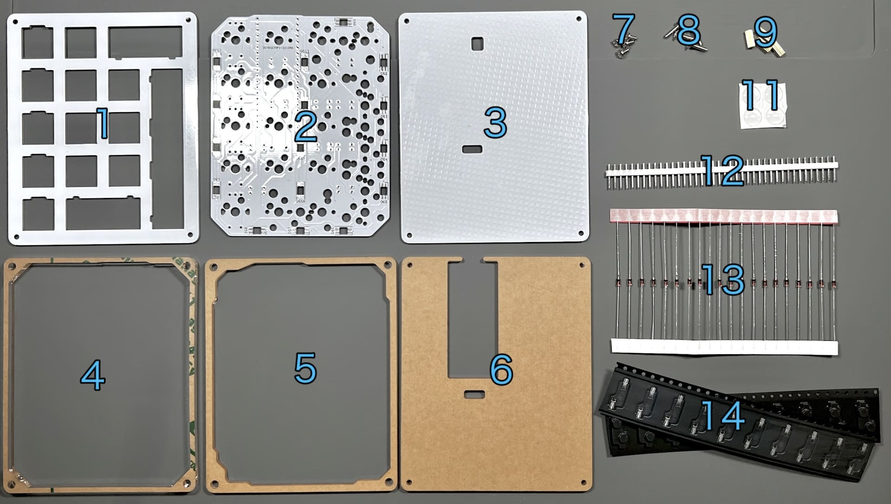
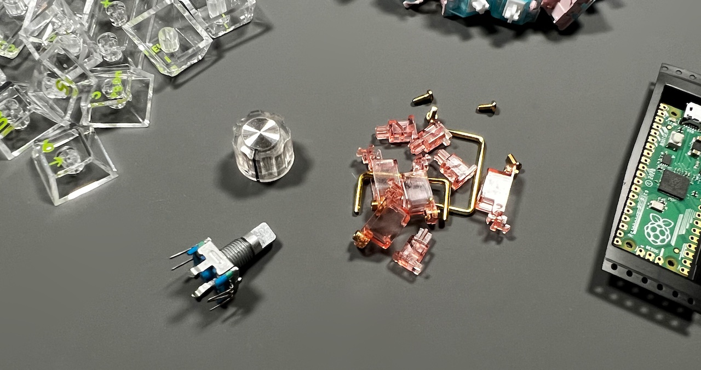
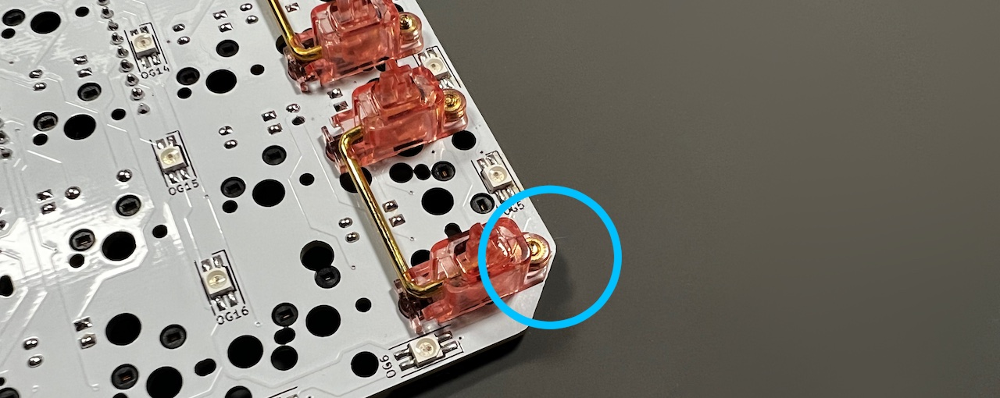
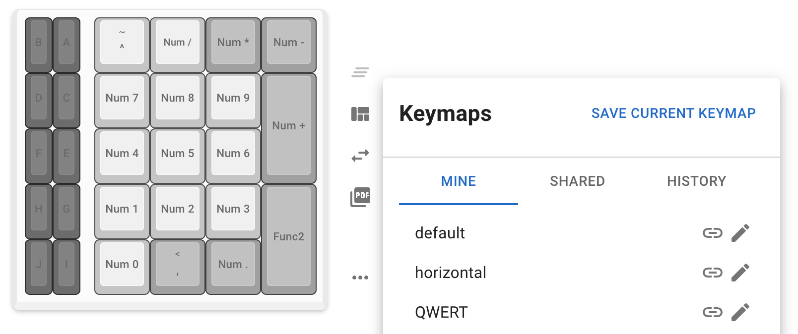

# Shotgun チェリーパイ ビルドガイド（[English](https://github.com/Taro-Hayashi/Shotgun-CherryPie/blob/main/README_EN.md)）
- [キット内容](#キット内容)
- [準備](#準備)
- [はんだ付け](#はんだ付け)
- [組み立て](#組み立て)
- [キーのカスタマイズ](#キーのカスタマイズ)
- [3Dプリンターケースの組み立て](#3Dプリンターケースの組み立て)
- [その他](#その他)

## キット内容

||部品名|数| |
|-|-|-|-|
|1|メインボード|1||
|2|トッププレート|1||
|3|ボトムプレート|1||
|4|ミドルプレート1|1~2|5mm厚か3mm厚|
|5|ミドルプレート2|1|3mm厚|
|6|ミドルプレート3|1|3mm厚|
|7|ネジ（短）|4|4mm|
|8|ネジ（長）|4|8mm|
|9|スペーサー|4||
|11|ゴム足|4||
|12|40Pピンヘッダ|1||
|13|ダイオード|20|1N4148|
|14|Cherry MX ホットスワップソケット|20||

### （おまけ）3Dプリンターケース

モデルデータ（CC-BYライセンス）
- 

### キット以外に必要なもの
|部品名|数||
|-|-|-|
|Raspberry Pi Pico|1|[秋月電子通商](https://akizukidenshi.com/catalog/g/g116132/)、[BOOTH（Type-C版）](https://tarohayashi.booth.pm/items/3430753)|
|[キースイッチ](https://shop.yushakobo.jp/collections/all-switches/cherry-mx-%E4%BA%92%E6%8F%9B-%E3%82%B9%E3%82%A4%E3%83%83%E3%83%81)|〜20|CherryMX互換|
|[キーキャップ](https://shop.yushakobo.jp/collections/keycaps/cherry-mx-%E4%BA%92%E6%8F%9B-%E3%82%AD%E3%83%BC%E3%82%AD%E3%83%A3%E3%83%83%E3%83%97)|〜20|スイッチに合うもの|
|USB ケーブル|1|データ転送対応のもの|

※遊舎工房さんの[Raspberry Pi Pico 互換ボード Type-C](https://shop.yushakobo.jp/products/10925)は3Dプリンターケースにのみ対応しています。

### オプション

|部品名|数||
|-|-|-|
|[スタビライザー](https://shop.yushakobo.jp/products/a0500st)|必要数|2U、PCBマウント|
|[ロータリーエンコーダー](https://shop.yushakobo.jp/products/3762)|～5|EC11/EC12/ロープロファイル|
|[ノブ](https://shop.yushakobo.jp/products/3733)|〜5|外径19mmまで|
|LED（[SK6812MINI-E](https://shop.yushakobo.jp/products/sk6812mini-e-10)）|12、もしくは28|12個で裏面のみ、28個で両面|
- [Shotgun チェリーパイ アクリル積層ケース](https://github.com/Taro-Hayashi/Shotgun-CherryPie-AcrylicCase/blob/main/README.md)

### 必要な工具
|工具名|
|-|
|はんだごて|
|はんだ|
|ピンセット|
|精密ドライバー|
|ニッパー等ダイオードの足を切れるもの|

## 準備
### レイアウトを決める
このキットはいろいろなレイアウトから選んでお使いいただけます。

色のついているところが交換可能になっています。

ビルドガイドではロータリーエンコーダーを1つ、幅が2倍（2U）のキーを二つ使ったテンキーにします。

キット、その他必要なものに追加でロータリーエンコーダーとノブを一つずつ、スタビライザーを2つ用意しました。

### テスト用ファームウェアの書き込み
こちらからテスト用ファームウェアをダウンロードしてください。
 - https://github.com/Taro-Hayashi/Shotgun-CherryPie/releases/latest/download/tarohayashi_shotgun_cp_default.uf2

Raspberry Pi Picoを、BOOTSELボタン押しながらUSBケーブルでPCと接続すると、RPI-RP2というUSBメモリとして認識されます。

ここにダウンロードしたuf2ファイルを書き込むと、Raspberry Pi Picoをキーボードとして使えるようになります。

書き込みが終わったら一旦USBケーブルは外します。

## はんだ付け
はんだ付けのやり方は動画で見るとわかりやすいです。
パーツは思ったより壊れないので落ち着いて作業すると失敗しにくいです。

 - ホームセンターのDCMさんの解説動画(58秒～)

### LEDのはんだ付け（オプション）
LEDを取り付ける場合はメインボードに最初にはんだ付けします。
 - [LEDの取り付け方](led.md)

後からでも可能ですが他の部品にこてが当たり溶かしてしまう可能性があります。

### ダイオードのはんだ付け

D1~D20まで取り付けます。
足を曲げて裏から差し込みます。

ダイオードには向きがあります。三角形の先の棒と黒線を合わせましょう。

表で更に足を曲げて抜けないようにします。

ダイオードと並行に曲げるとあとでキースイッチに干渉しにくいです。

はんだ付けをして足を切ります。

### ソケットのはんだ付け
使うソケットのパッドにソケットを乗せます。

ソケットを置いたらピンセットで押さえつけながらはんだを注いでいきます。入り組んでいて表面積が多いので多めに必要になります。

裏から見ると左右が逆になっているのでレイアウトに注意してソケットの位置を決めます。

青枠の部分にあるソケットは基板になるべく密着するようにはんだ付けしてください。

### （オプション）ロータリーエンコーダーのはんだ付け
足を折らないようにホールに通します。

あとで場所を変更する可能性があるときはクリップの部分ははんだ付けしなくても大丈夫です。

### Raspberry Pi Picoのはんだ付け
ピンヘッダを20ピンずつに切るか折るかします。

Raspberry Pi Picoを取り外せなくなるので隠れてしまうダイオードの方向やソケットのはんだ付けを改めて確認してください。

ピンヘッダを基板に立てます。どちら側でも構いませんが長い方を挿しました。

GP0、VBUS位置を合わせてRaspberry Pi Picoを乗せ、はんだ付けします。

表面の足を切りはんだ付けします。

### 動作確認
Raspberry Pi PicoにUSBケーブルを繋ぎます。

ソケットをピンセットで短絡したり、スイッチを挿して押したりしてキーが入力されるか調べます。

問題がなければはんだ付けは終了です。お疲れ様でした。

## 組み立て
### （オプション）スタビライザーの組み立てと取り付け
スタビライザーがあると2Uのキーの押下が安定します。無くても使えるのでお好みでお使いください。

小さい方のパーツの穴が二つ開いている側を、大きいパーツの穴が開いている方向に合わせて組み合わせます。

金属の棒を下の穴に差し込みツメにパチっと音がするまで押し込んで完成です。

基板の大きい方の穴にツメをひっかけながら取り付けます。

角にスタビライザーを付けるとケースと干渉するためニッパーで切り落としています。

### プレートの取り付け
傷が付かないように裏返しに組み立てられて梱包されているので一度すべてのネジ、スペーサーを外してください。
アクリルプレートからは保護フィルムをはがします。割れやすいパーツもあるので気をつけてください。

メインボードにトッププレートを乗せます。裏表、上下左右に気を付けましょう。

隅のキースイッチから差し込んで、トッププレートにツメを咬ませます。

全てのスイッチを取り付けました。

トッププレートは浮いていますが、スイッチのツメに引っかかっているため安定しているはずです。

裏返して4隅にスペーサーを、ネジ（短）で取り付けます。

ミドルプレート1（5mm厚1枚、もしくは3mm厚が2枚、穴が長方形に近い）、ミドルプレート2（3mm厚、穴が少し狭い）の順にスペーサーに通します。

Raspberry Pi PicoのUSB端子を避ける時に割れないように気を付けてください。

ミドルプレート3を乗せます。

バックプレートをネジ（長）で組付けてゴム足を4隅に貼ります。

キーキャップを乗せたら組み立ては終了です。

早速USBケーブルでPCと接続してRemap用ファームウェアを書き込みましょう。
 - https://github.com/Taro-Hayashi/Shotgun-CherryPie/releases/latest/download/tarohayashi_shotgun_cp_via.uf2

裏面のスリットからリセットボタンを押すか、USBのすぐ下のキーを押しながらケーブルを接続して2秒待ってから離すとRPI-RP2フォルダを出すことができます。

## キーのカスタマイズ
RemapにGoogle ChromeかMicrosoft Edgeでアクセスしてください。
- Remap https://remap-keys.app

左を選んで進んでいくとアドレスバーからメッセージが出てキーボードを選択できます。

ドラッグアンドドロップでキーマップの変更が終わったら右上のflashボタンを押すと反映されます。

### キーのサイズを合わせる
レイアウトオプションから2Uキーの設定をすることができます。

### 特殊なキーを設定する
FUNCTIONSタブのVIA USER KEYにあらかじめ用意されたショートカットキーがあります。

### キーマップの保存と復元
⇔アイコンで作ったキーマップを保存することができます。
いくつかサンプルをご用意しました。自分のレイアウトを公開することもできるので是非お試しください。

## 3Dプリンターケースの組み立て
スイッチプレートにスペーサーを付けた状態にします。

ケースに入れて裏面でネジ止め、ゴム足を貼ります。

完成です。

## その他

### PRK Firmware
Paspberry Pi Picoをキーボードとして扱う方法は他にも複数あります。PRK Firmwareはその一つでキー入れ替えの試行錯誤が手軽なところが特徴です。
- [PRK Firmware](https://github.com/picoruby/prk_firmware/)

### ファームウェアのコード
 - https://github.com/Taro-Hayashi/qmk_firmware/tree/tarohayashi/keyboards/tarohayashi/shotgun_cp

### プレートのデータ
 - [shotgun_cp_plates.zip](https://github.com/Taro-Hayashi/Shotgun-CherryPie/releases/latest/download/shotgun_cp_plates.zip)

発注先のルールに沿ってデータを修正してください。

### 謝辞
foostan様のフットプリントを流用、改変して使わせていただきました。
https://github.com/foostan/kbd/
https://github.com/foostan/kbd/blob/master/LICENSE

yoichiro様のフットプリントを流用、改変して使わせていただきました。
https://github.com/yoichiro/yoichiro-kbd
https://github.com/yoichiro/yoichiro-kbd/blob/main/LICENSE

せきごん様がGPIO15を使っている場合でも正常に動くようにしてくださいました。
https://github.com/sekigon-gonnoc/qmk_firmware/tree/rp2040

hasumikin様がPRK Firmwareでロータリーエンコーダーを複数個使用できるようにして、感度も上げてくださいました。
https://github.com/picoruby/prk_firmware/

### 販売サイト
- BOOTH: https://tarohayashi.booth.pm/items/3430753
- 遊舎工房: https://shop.yushakobo.jp/products/3415
