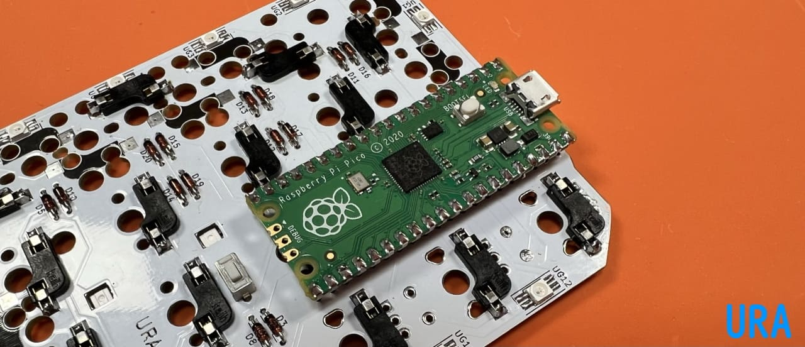

# Shotgun チェリーパイ ビルドガイド（[English](https://github.com/Taro-Hayashi/Shotgun-CherryPie/blob/main/README_EN.md)）
※2022年3月販売分からピンヘッダが同梱になり、コンスルーが必須ではなくなりました。  
以前のビルドガイドは[こちら](https://github.com/Taro-Hayashi/Shotgun-CherryPie/blob/main/README_OLD.md)。  
- [キット内容](#キット内容)
- [準備](#準備)
- [はんだ付け](#はんだ付け)
- [組み立て](#組み立て)
- [キーマップのカスタマイズ](#キーマップのカスタマイズ)
- [その他](#その他)

## キット内容
  
||部品名|数| |
|-|-|-|-|
|1|メインボード|1||
|2|トッププレート|1||
|3|ボトムプレート|1||
|4|ミドルプレート1|1|5mm厚|
|5|ミドルプレート2|1|3mm厚|
|6|ミドルプレート3|1|3mm厚|
|7|ネジ（短）|4|4mm|
|8|ネジ（長）|4|8mm|
|9|スペーサー|4|8mm|
|10|ダイオード|20|1N4148|
|11|リセットスイッチ|1||
|12|Cherry MX ホットスワップソケット|20||
|13|ゴム足|4||
|-|40Pピンヘッダ|1||

### キット以外に必要なもの
|部品名|数|||
|-|-|-|-|
|Raspberry Pi Pico|1||[遊舎工房](https://shop.yushakobo.jp/products/raspberry-pi-pico) / [秋月電子通商](https://akizukidenshi.com/catalog/g/gM-16132/) / [共立エレショップ](https://eleshop.jp/shop/g/gL25313/)|
|キースイッチ||CherryMX互換|[遊舎工房](https://shop.yushakobo.jp/collections/all-switches/cherry-mx-%E4%BA%92%E6%8F%9B-%E3%82%B9%E3%82%A4%E3%83%83%E3%83%81) / [TALPKEYBOARD](https://talpkeyboard.net/?category_id=59cf8860ed05e668db003f5d) / [DailyCraftKeyboard](https://shop.dailycraft.jp/collections/mx-switches)|
|キーキャップ||CherryMX互換|[遊舎工房](https://shop.yushakobo.jp/collections/keycaps/cherry-mx-%E4%BA%92%E6%8F%9B-%E3%82%AD%E3%83%BC%E3%82%AD%E3%83%A3%E3%83%83%E3%83%97) / [TALPKEYBOARD](https://talpkeyboard.net/?category_id=59e2acfaed05e644fd004008)|
|Micro-USB ケーブル|1|||

### オプション
|部品名|数|||
|-|-|-|-|
|コンスルー20ピン (高さ2 mmか2.5 mm)|2|[使い方](https://github.com/Taro-Hayashi/Shotgun-CherryPie/blob/main/conthrough2.md)|[遊舎工房](https://shop.yushakobo.jp/products/31?variant=40815837610145) / [共立エレショップ](https://eleshop.jp/shop/g/gKB6127/)|
|スタビライザー|必要数|2U、PCBマウント|[遊舎工房](https://shop.yushakobo.jp/collections/all-keyboard-parts/Stabilizer) / [TALPKEYBOARD](https://talpkeyboard.net/?category_id=5f884b9b3313d216eb50558a)|
|ロータリーエンコーダ|～5|EC11/EC12/ロープロファイル|[遊舎工房](https://shop.yushakobo.jp/search?q=%E3%83%AD%E3%83%BC%E3%82%BF%E3%83%AA%E3%83%BC%E3%82%A8%E3%83%B3%E3%82%B3%E3%83%BC%E3%83%80%E3%83%BC+%E3%83%8E%E3%83%96%E4%BB%98%E3%81%8D) / [TALPKEYBOARD](https://talpkeyboard.net/items/5f3f1a597df28129f2fd4b0f) / [DailyCraftKeyboard](https://shop.dailycraft.jp/products/encoder_low) / [Amazon](https://www.amazon.co.jp/s?k=EC11+%E3%82%A8%E3%83%B3%E3%82%B3%E3%83%BC%E3%83%80%E3%83%BC&language=ja_JP)|
|ノブ|～5|外径19mmまで|[DailyCraftKeyboard](https://shop.dailycraft.jp/products/encoder_lowprofile_knob) / [Amazon](https://www.amazon.co.jp/s?k=%E3%82%A8%E3%83%B3%E3%82%B3%E3%83%BC%E3%83%80%E3%83%BC+%E3%83%8E%E3%83%96)|
|SK6812MINI-E|12、もしくは28|12個で裏面のみ、28個で両面になります。|[遊舎工房](https://shop.yushakobo.jp/products/sk6812mini-e-10) / [秋月電子通商](https://akizukidenshi.com/catalog/g/gI-15478/)|

### 必要な工具
|工具名|
|-|
|はんだごて|
|こて先クリーナー（こて台）|
|鉛入りはんだ|
|ピンセット|
|精密ドライバー|
|ニッパー等ダイオードの足を切れるもの|

### あると便利な工具
|工具名|
|-|
|耐熱シリコンマット|
|温度調節可能なはんだごて|
|斜めに切ったタイプのこて先|
|フラックス|
|フラックスリムーバー、IPA|
|テスター|
|マスキングテープ|
|はんだ吸い取り線|
|はんだ吸い取り器|

## 準備
### レイアウトを決める  
このキットはいろいろなレイアウトから選んでお使いいただけます。  
   
色のついているところが交換可能になっています。  
  
ビルドガイドではロータリーエンコーダーを1つ、幅が2倍（2U）のキーを二つ使ったテンキーにします。  
   
キット、その他必要なものに追加でロータリーエンコーダーとノブを一つずつ、スタビライザーを2つ用意しました。  
   

### ファームウェアの書き込み
最新版のPRKファームウェアのzipファイルをダウンロード、解凍します。
 - [Releases・picoruby/prk_firmware](https://github.com/picoruby/prk_firmware/releases)  

Assetsをクリックすると出てきます。
 

Raspberry Pi Picoを、BOOTSELボタン押しながらUSBケーブルでPCと接続すると、RPI-RP2というUSBメモリとして認識されます。  
   
   
そこに解凍したuf2ファイルを書き込むと、自動的に再起動して代わりにPRK Firmwareというドライブとして認識されます。  
   
そのドライブにこちらのkeymap.rbをドラッグアンドドロップするとRaspberry Pi Picoをキーボードとして使えるようになります。 
 - [keymap.rb](https://github.com/Taro-Hayashi/Shotgun-CherryPie/releases/download/0.1/keymap.rb)  

書き込みが終わったら一旦USBケーブルは外します。  

## はんだ付け
はんだ付けのやり方は動画で見るとわかりやすいです。  
パーツは思ったより壊れないので落ち着いて作業すると失敗しにくいです。  
 - ホームセンターのDCMさんの解説動画(58秒～) https://www.youtube.com/watch?v=JFQg_ObITYE&t=58s  
  
### （オプション）LEDのはんだ付け
LEDを取り付ける場合はメインボードに最初にはんだ付けします。  
 - [LEDの取り付け方](led.md)  

後からでも可能ですがホットスワップソケットにこてが当たり溶かしてしまう可能性があります。  

### ダイオード、リセットスイッチのはんだ付け

D1~D20まで取り付けます。  
足を曲げて裏から差し込みます。  
   
ダイオードには向きがあります。三角形の先の棒と黒線を合わせましょう。  
  
表で更に足を曲げて抜けないようにします。  
   
ダイオードと並行に曲げるとあとでキースイッチに干渉しにくいです。 
  
はんだ付けをして足を切ります。  
   
  
  
リセットスイッチを裏から差し込み表ではんだ付けします。  
   

### ソケットのはんだ付け
使うソケットのパッドに予備はんだをします。あらかじめ薄くはんだを乗せます。  
    
ソケットを置いたらピンセットで押さえつけながらはんだを注いでいきます。入り組んでいて表面積が多いので多めに必要になります。  
     

青枠の部分にあるソケットは基板になるべく密着するようにはんだ付けしてください。  
   
裏から見ると左右が逆になっているのでレイアウトに注意しましょう。  

### （オプション）ロータリーエンコーダーのはんだ付け
足を折らないようにホールに通します。  
   
クリップの部分ははんだ付けしなくても大丈夫です。  
   

### Raspberry Pi Picoのはんだ付け
ピンヘッダを20ピンずつに切るか折るかします。
   
Raspberry Pi Picoを取り外せなくなるので隠れてしまうダイオードの方向やソケットのはんだ付けを改めて確認してください。  
  
ピンヘッダを基板に立てます。どちら側でも構いませんが長い方を挿しました。
   
GP0、VBUS位置を合わせてRaspberry Pi Picoを乗せ、はんだ付けします。  
   
表面の足を切りはんだ付けします。  
   

### 動作確認
Raspberry Pi PicoにUSBケーブルを繋ぎます。
   
ソケットをピンセットで短絡したり、スイッチを挿して押したりしてキーが入力されるか調べます。  
  
問題がなければはんだ付けは終了です。お疲れ様でした。  
  
## 組み立て
### （オプション）スタビライザーの組み立てと取り付け
スタビライザーがあると2Uのキーの押下が安定します。無くても使えるのでお好みでお使いください。  
  
小さい方のパーツの穴が二つ開いている側を、大きいパーツの穴が開いている方向に合わせて組み合わせます。  
  
金属の棒を下の穴に差し込みツメにパチっと音がするまで押し込んで完成です。
    
  
商品によっては防音シートがついています。  
  
角にスタビライザーを付けるとケースと干渉するためニッパーで切り落としています。  
  
両側がツメになっているタイプとねじ止めをするタイプがあります。  
  
ねじ止めだとキーキャップを抜くときに一緒にスタビライザーが抜けてしまうのを防げます。  
  
基板の大きい方の穴にツメをひっかけながら取り付けます。  
  

### プレートの取り付け
傷が付かないように裏返しに組み立てられて梱包されているので一度すべてのネジ、スペーサーを外してください。
アクリルプレートからは保護フィルムをはがします。割れやすいパーツもあるので気をつけてください。  

メインボードにトッププレートを乗せます。裏表、上下左右に気を付けましょう。  
  

隅のキースイッチから差し込んで、トッププレートにツメを咬ませます。  
  

全てのスイッチを取り付けました。  
  
トッププレートは浮いていますが、スイッチのツメに引っかかっているため安定しているはずです。  

裏返して4隅にスペーサーを、ネジ（短）で取り付けます。  
  

ミドルプレート1（5mm厚、穴が長方形に近い）、ミドルプレート2（3mm厚、穴が少し狭い）の順にスペーサーに通します。  
  
Raspberry Pi PicoのUSB端子を避ける時に割れないように気を付けてください。

ミドルプレート3を乗せます。  
  

バックプレートをネジ（長）で組付けてゴム足を4隅に貼ります。  
  

キーキャップを乗せたら組み立ては終了です。
  

早速USBケーブルでPCと接続しましょう。

## キーマップのカスタマイズ
ビルドガイドと同じレイアウトにするのであればこちらをそのまままお使いください。  
 - [keymap.rb](https://github.com/Taro-Hayashi/Shotgun-CherryPie/releases/download/0.9.8/keymap.rb)

最初にダウンロードしたものとファイル名が同じなので気を付けてください。  
同様のテンキーとして使う場合もひな形にすると楽になると思います。  

### キーの変更
PRK Firmwareドライブのkeymap.rbを開きます。  

~~~
kbd.add_layer :default, %i[
  KC_A  KC_B  KC_C  KC_D
  KC_E  KC_F  KC_G  KC_H
  KC_I  KC_J  KC_K  KC_L
  KC_M  KC_N  KC_O  KC_P
  KC_Q  KC_R  KC_S  KC_T
]
~~~
ここのKC_*を書き換えてキーを設定します。  
  
キーコードはこちらに載せていますので参考にしてください（バージョンによって違う可能性があります）。  
- https://github.com/Taro-Hayashi/PRKFirmware0.9.7Keycode  

上書き保存をするとその場で変更が反映されます。  

### ロータリーエンコーダー
~~~
encoder_1 = RotaryEncoder.new(27, 28)
encoder_1.clockwise do
  kbd.send_key :KC_1
end
encoder_1.counterclockwise do
  kbd.send_key :KC_2
end
kbd.append encoder_1
~~~
kbd.send_keyのKC_*を変更すると該当のロータリーエンコーダーのキーが変更されます。  
ロータリーエンコーダーはUSB差込側から順に1～5が割り振られています。  

### レイヤーの追加
~~~
kbd.add_layer :lower, %i[
  KC_NO  KC_NO  KC_NO  KC_NO
  KC_NO  KC_NO  KC_NO  KC_NO
  KC_NO  KC_NO  KC_NO  KC_NO
  KC_NO  KC_NO  KC_NO  KC_NO
  KC_NO  KC_NO  KC_NO  KC_NO
]
~~~
レイヤーの名前を変更したキーマップを追加するとレイヤーが増えます。  
レイヤーの名前をキーコードとして使うとそのままレイヤー変更キーとして使えます。  
  
好きな名前のキーコード名を設定し（例では0_LOW）、長押しでレイヤーを変更するキーにすることもできます。  
~~~
kbd.define_mode_key :0_LOW, [ :KC_KP_0, :lower, 150, 150 ]
~~~

### 同時押しのキーコード
~~~
kbd.define_composite_key :UNDO,  %i(KC_Z KC_LCTL)
~~~
例えばCtrl＋Zであればこのように定義します。  

### 文字列を入力するキーコード
~~~
kbd.define_mode_key :TEST, [ Proc.new { kbd.macro "aaaa" }, :KC_NO, 300, nil ]
~~~
あっているかわかりませんがこう定義するとaaaaが入力されました。  
00キーの場合上の同時押しの方が早かったのでそちらを使っています。  
  
キーの設定が終わったら完成です！  
  
  

## その他
### おまけ
小袋のアクリル片とスペーサーを組み合わせると裏面のボタンを押す治具を作れます。
  
※アクリルの形状は違うことがあります。

### QMKファームウェア
こちらのuf2ファイルをインストールしてください。
- [shotgun_cp_via.uf2](https://github.com/Taro-Hayashi/Shotgun-CherryPie/releases/download/0.9.8/shotgun_cp_via.uf2)

QMKは公式にはRaspberry Pi Picoには対応していません。使用しているQMKファームウェアはせきごん様が独自にRP2040への対応を実現したものです。  
基本的な機能は実装済みのものを配布していますが、ご自分でコンパイルをしたい場合はこちらのページを参考にしてください。  
 - [RP2040対応のQMK(非公式)を動かす](https://scrapbox.io/self-made-kbds-ja/RP2040%E5%AF%BE%E5%BF%9C%E3%81%AEQMK(%E9%9D%9E%E5%85%AC%E5%BC%8F)%E3%82%92%E5%8B%95%E3%81%8B%E3%81%99)
 - [ファームウェアのコード](https://github.com/Taro-Hayashi/Shotgun-CherryPie/tree/main/qmk/keyboards/shotgun_cp)

Remap/VIAを使ってGUIでキーを入れ替えることができます。
 - [shotgun_cp.json](https://github.com/Taro-Hayashi/Shotgun-CherryPie/releases/download/0.9.8/shotgun_cp.json)

### プレートのデータ
 - [shotgun_cp_plates.zip](https://github.com/Taro-Hayashi/Shotgun-CherryPie/releases/download/0.9.8/shotgun_cp_plates.zip)  

発注先のルールに沿ってデータを修正してください。  

### 謝辞
foostan様のフットプリントを流用、改変して使わせていただきました。  
https://github.com/foostan/kbd/  
https://github.com/foostan/kbd/blob/master/LICENSE  

yoichiro様のフットプリントを流用、改変して使わせていただきました。  
https://github.com/yoichiro/yoichiro-kbd  
https://github.com/yoichiro/yoichiro-kbd/blob/main/LICENSE 

せきごん様がGPIO15を使っている場合でも正常に動くようにしてくださいました。  
https://github.com/sekigon-gonnoc/qmk_firmware/tree/rp2040

hasumikin様がPRK Firmwareでロータリーエンコーダーを複数個使用できるようにして、感度も上げてくださいました。  
https://github.com/picoruby/prk_firmware/

### 販売ページ
- BOOTH: https://tarohayashi.booth.pm/items/3430753
- 遊舎工房: https://shop.yushakobo.jp/products/3415

