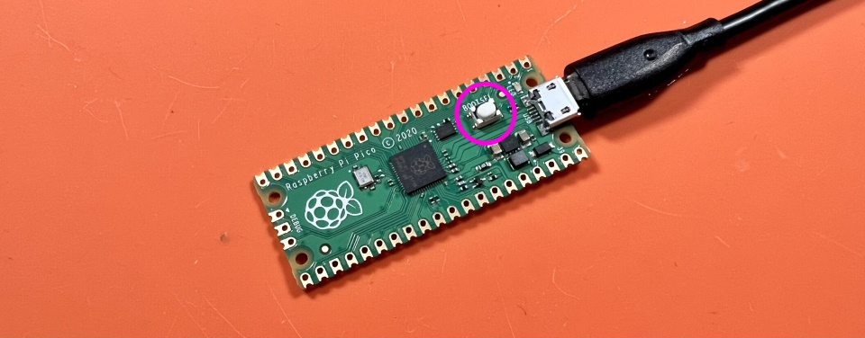
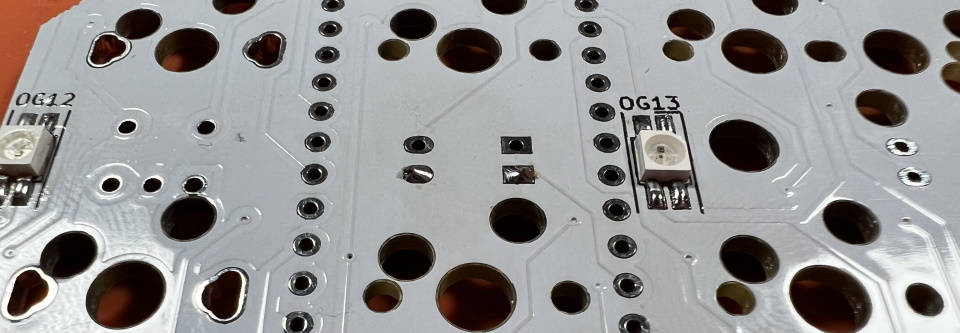
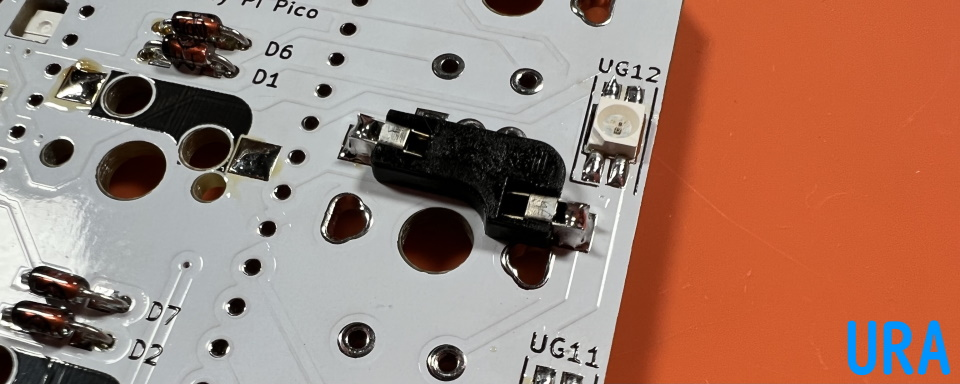
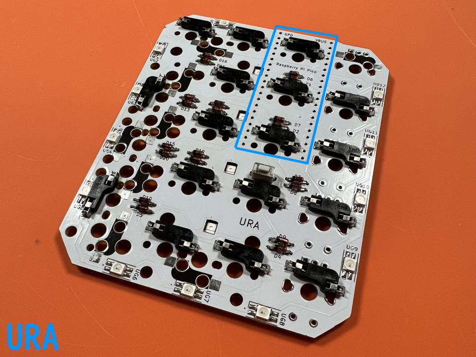
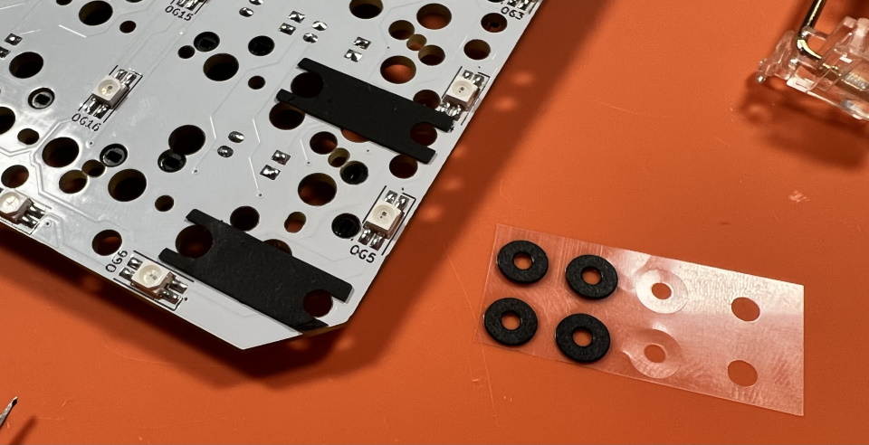
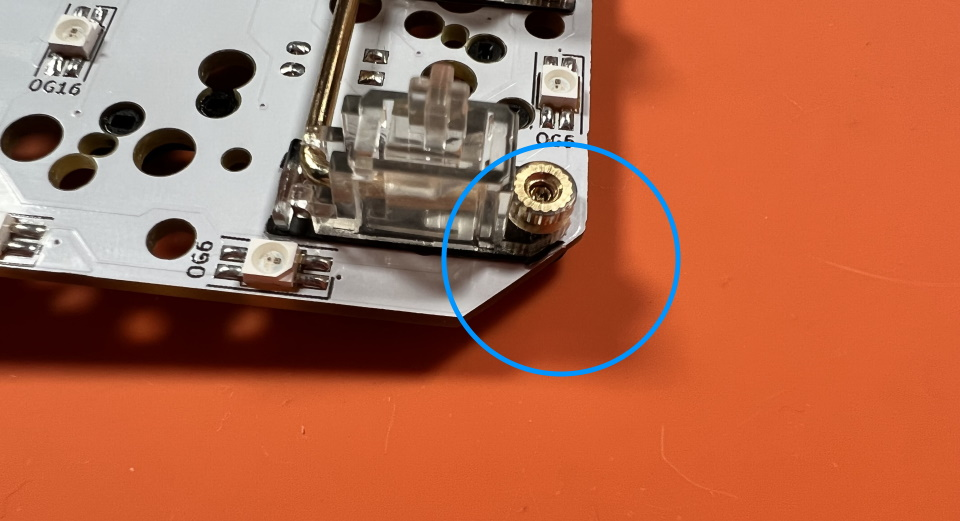
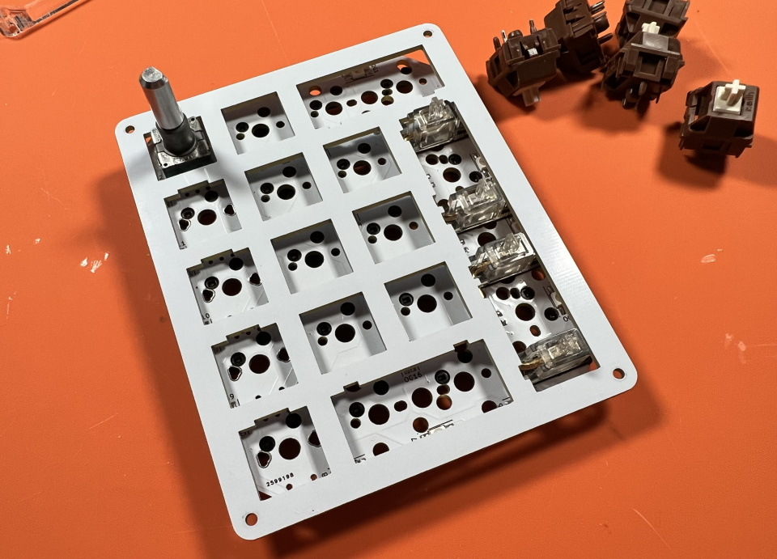
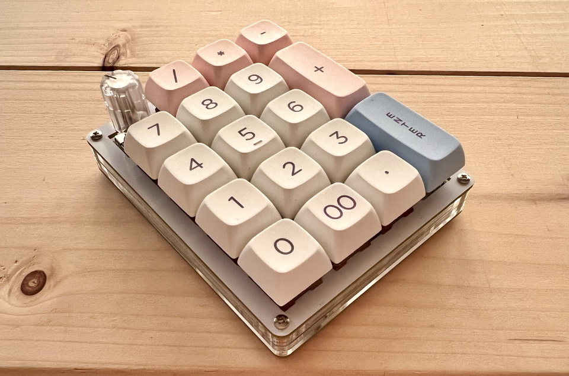

# Shotgun チェリーパイ Build Manual（[日本語](https://github.com/Taro-Hayashi/Shotgun-CherryPie/blob/main/README.md)）
- [Contens](#Contens)
- [Preparation](#Preparation)
- [Soldering](#Soldering)
- [Assembling](#Assembling)
- [Customise](#Customise)

## Contents
  
||Name|Quamtities| |
|-|-|-|-|
|1|Mainboard|1|
|2|Top plate|1||
|3|Bottom plate|1||
|4|Middle plate #1|1||
|5|Middle plate #2|1||
|6|Middle plate #3|1||
|7|Short screws|4|4mm|
|8|Long screws|4|8mm|
|9|Spacers|4|8mm|
|10|Diodes|20|1N4148|
|11|Tactile switch|1||
|12|Hotswap socket|20||
|13|Rubber feet|4||

### Additional required
|Name|Quantities|||
|-|-|-|-|
|Raspberry Pi Pico|1||[Yushakobo](https://shop.yushakobo.jp/en/products/raspberry-pi-pico)|
|Conthrough|2|[Usage](conthrough_EN.md)|[Yushakobo](https://shop.yushakobo.jp/en/products/31?_pos=1&_sid=ca92edae3&_ss=r&variant=40815837610145)|
|Switches|11 - 20|Cherry MX|[Yushakobo](https://shop.yushakobo.jp/en/collections/all-switches/cherry-mx-%E4%BA%92%E6%8F%9B-%E3%82%B9%E3%82%A4%E3%83%83%E3%83%81)|
|Keycaps|11 - 20|Cherry MX|[Yushakobo](https://shop.yushakobo.jp/en/collections/keycaps/cherry-mx-%E4%BA%92%E6%8F%9B-%E3%82%AD%E3%83%BC%E3%82%AD%E3%83%A3%E3%83%83%E3%83%97)|
|Micro-USB Cable|1||[Yushakobo](https://shop.yushakobo.jp/en/products/usb-cable-micro-b-0-8m)|

### オプション
|部品名|数|||
|-|-|-|-|
|Stabilizer||2U, PCB mounted|[Yushakobo](https://shop.yushakobo.jp/en/collections/all-keyboard-parts/Stabilizer)|
|Rotary emcoders||EC11/EC12||
|knobs||Outer diameter up to 19mm||
|SK6812MINI-E|28||[Yushakobo](https://shop.yushakobo.jp/en/products/sk6812mini-e-10)|

## Preparation
### Determine key layout  
This kit has a variety of layouts to choose from.  
   
  

In this manual, we use rotary encoder and 2 2U keys.  
    
   

### Write firmware
Download PRK Firmware.
 - [Releases・picoruby/prk_firmware](https://github.com/picoruby/prk_firmware/releases)  

Click "Assets"
 

Connect the Raspberry Pi Pico to the PC while holding down the BOOTSEL button, it will be recognized as a USB memory device called RPI-RP2.    
   
   
Writing the uf2 file, it will automatically reboot and be recognized as a drive called PRK Firmware.  
   
Drag and drop this keymap.rb onto the drive.
 - [keymap.rb](https://github.com/Taro-Hayashi/Shotgun-CherryPie/releases/download/0.1/keymap.rb)  

Detouch the USB cable.

## Soldering

### Raspberry Pi Pico

まずはRaspberry Pi Picoにコンスルーをはんだ付けします。  
コンスルーを基板裏に立てます。窓が高く、同じ方向を向くようにします。  
   
基板側ははんだ付けしません。  
  
   
立てたコンスルーにRaspberry Pi Picoを乗せたらはんだ付けします。    
   
できるだけ垂直に力を加えてRaspberry Pi Picoを抜きます。  

### LEDs
LEDを取り付ける場合はメインボードに最初にはんだ付けします。  
 - [LEDの取り付け方](led.md)  

後からでも可能ですがホットスワップソケットにこてが当たり溶かしてしまう可能性があります。  

### Diodes and reset switch

D1~D20まで取り付けます。  
足を曲げて裏から差し込みます。  
   
ダイオードには向きがあります。三角形の先の棒と黒線を合わせましょう。  
  
表で更に足を曲げて抜けないようにします。  
   
ダイオードと並行に曲げるとあとでキースイッチに干渉しにくいです。 
  
はんだ付けをして足を切ります。  
   
  
  
リセットスイッチを裏から差し込み表ではんだ付けします。  
   

### Hotswap sockets
使うソケットの足に予備はんだをします。あらかじめ薄くはんだを乗せます。  
    
ソケットを置いたらピンセットで押さえつけながらはんだを注いでいきます。入り組んでいて表面積が多いので多めに必要になります。  
     

裏から見ると左右逆になっているのでソケットの位置に注意しましょう。  
   

### Rotary encoder
足を折らないようにホールに通します。  
   
クリップの部分ははんだ付けしなくて大丈夫です。  
   

### Testing
Raspberry Pi Picoを差し込んでUSBケーブルを繋ぎます。  
  
   
ソケットをピンセットで短絡したり、スイッチを挿して押したりしてキーが入力されるか調べます。  
  
問題がなければはんだ付けは終了です。お疲れ様でした。  
Raspberry Pi Picoを取り外して次の工程に進みましょう。  
  
## Assembling
### Stabilizers
スタビライザーがあると2Uのキーの押下が安定します。無くても使えるのでお好みでお使いください。  
  
小さい方のパーツの穴が二つ開いている側を、大きいパーツの穴が開いている方向に合わせて組み合わせます。  
  
金属の棒を下の穴に差し込みツメにパチっと音がするまで押し込んで完成です。
    
  
商品によっては防音シートがついています。  
  
角にスタビライザーを付けるとケースと干渉するためニッパーで切り落としています。  
  
両側がツメになっているタイプとねじ止めをするタイプがあります。  
  
ねじ止めだとキーキャップを抜くときに一緒にスタビライザーが抜けてしまうのを防げます。  
  
基板の大きい方の穴にツメをひっかけながら取り付けます。  
  

### Plates
アクリルから保護フィルムをはがします。割れやすいパーツもあるので気をつけてください。  

メインボードにトッププレートを乗せます。裏表、上下左右に気を付けましょう。  
  

隅のキースイッチから差し込んで、トッププレートにツメを咬ませます。  
  

全てのスイッチを取り付けました。  
  
トッププレートは浮いていますが、スイッチのツメに引っかかっているため安定しているはずです。  

裏返して4隅にスペーサーを、ネジ（短）で取り付けます。  
  

ミドルプレート1（5mm厚、穴が長方形に近い）、ミドルプレート2（3mm厚、穴が少し狭い）の順にスペーサーに通します。  
  

Raspberry Pi Picoをピンを曲げないように取り付けてミドルプレート3を乗せます。  
  

バックプレートをネジ（長）で組付けてゴム足を4隅に貼ります。  
  

キーキャップを乗せたら組み立ては終了です。
  

早速USBケーブルでPCと接続しましょう。

## Customise
ビルドガイドと同じレイアウトにするのであればこちらをそのまままお使いください。  
 - [keymap.rb](https://github.com/Taro-Hayashi/Shotgun-CherryPie/releases/download/0.9.8/keymap.rb)

最初にダウンロードしたものとファイル名が同じなので気を付けてください。
同様のテンキーとして使う場合もひな形にすると楽になると思います。

### Change keys
PRK Firmwareドライブのkeymap.rbを開きます。  

~~~
kbd.add_layer :default, %i[
  KC_A  KC_B  KC_C  KC_D
  KC_E  KC_F  KC_G  KC_H
  KC_I  KC_J  KC_K  KC_L
  KC_M  KC_N  KC_O  KC_P
  KC_Q  KC_R  KC_S  KC_T
]
~~~
ここのKC_*を書き換えてキーを設定します。  
  
キーコードはこちらに載せていますので参考にしてください（バージョンによって違う可能性があります）。  
- https://github.com/Taro-Hayashi/PRKFirmware0.9.7Keycode  

上書き保存をするとその場で変更が反映されます。  

### Rotary Encoder
~~~
encoder_1 = RotaryEncoder.new(27, 28)
encoder_1.clockwise do
  kbd.send_key :KC_1
end
encoder_1.counterclockwise do
  kbd.send_key :KC_2
end
kbd.append encoder_1
~~~
kbd.send_keyのKC_*を変更すると該当のロータリーエンコーダーのキーが変更されます。  
ロータリーエンコーダーはUSB差込側から順に1～5が割り振られています。  

### Add layer
~~~
kbd.add_layer :lower, %i[
  KC_NO  KC_NO  KC_NO  KC_NO
  KC_NO  KC_NO  KC_NO  KC_NO
  KC_NO  KC_NO  KC_NO  KC_NO
  KC_NO  KC_NO  KC_NO  KC_NO
  KC_NO  KC_NO  KC_NO  KC_NO
]
~~~
レイヤーの名前を変更したキーマップを追加するとレイヤーが増えます。  
レイヤーの名前をキーコードとして使うとそのままレイヤー変更キーとして使えます。  
  
好きな名前のキーコード名を設定し（例では0_LOW）、長押しでレイヤーを変更するキーにすることもできます。  
~~~
kbd.define_mode_key :0_LOW, [ :KC_KP_0, :lower, 150, 150 ]
~~~

### 同時押しのキーコード
~~~
kbd.define_mode_key :UNDO,   [ %i(KC_Z KC_LCTL), :nil, 150, 150 ]
~~~
例えばCtrl＋Zであればこのように定義します。  

### 文字列を入力するキーコード
~~~
kbd.define_mode_key :TEST, [ Proc.new { kbd.macro "aaaa" }, :KC_NO, 300, nil ]
~~~
あっているかわかりませんがこう定義するとaaaaが入力されました。  
00キーの場合上の同時押しの方が早かったのでそちらを使っています。  
  
キーの設定が終わったら完成です！  
  
  

## Etc
### Switch pusher
小袋のアクリル片とスペーサーを組み合わせると裏面のボタンを押す治具を作れます。
  
※アクリルの形状は違うことがあります。

### 他の対応ファームウェアについて
#### QMK Firmware
Install qmk uf2 file.
- [shotgun_cp_via.uf2](https://github.com/Taro-Hayashi/Shotgun-CherryPie/releases/download/0.9.8/shotgun_cp_via.uf2)

JSON for Remap/VIA
 - [shotgun_cp.json](https://github.com/Taro-Hayashi/Shotgun-CherryPie/releases/download/0.9.8/shotgun_cp.json)

### Misc
Plates data
 - [shotgun_cp_plates.zip](https://github.com/Taro-Hayashi/Shotgun-CherryPie/releases/download/0.9.8/shotgun_cp_plates.zip)  

Used foostan's footprint.
https://github.com/foostan/kbd/  
https://github.com/foostan/kbd/blob/master/LICENSE  

Used Yoichiro's footprint.
https://github.com/yoichiro/yoichiro-kbd  
https://github.com/yoichiro/yoichiro-kbd/blob/main/LICENSE 

Sekigon's qmk firmware branch 
https://github.com/sekigon-gonnoc/qmk_firmware/tree/rp2040

PRK Firmware
https://github.com/picoruby/prk_firmware/

- BOOTH: https://tarohayashi.booth.pm/items/3430753
- Yushakobo: https://shop.yushakobo.jp/en/products/3415

