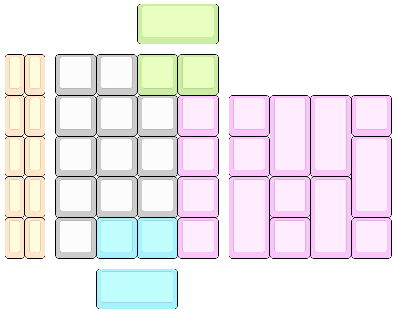
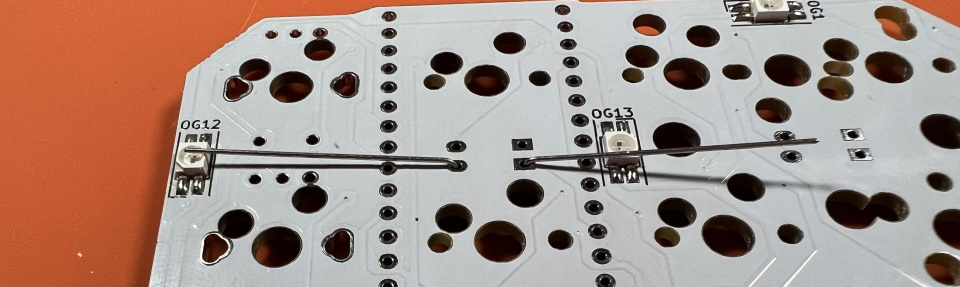
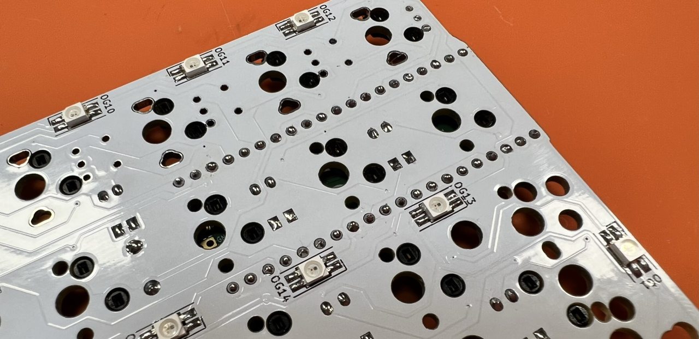
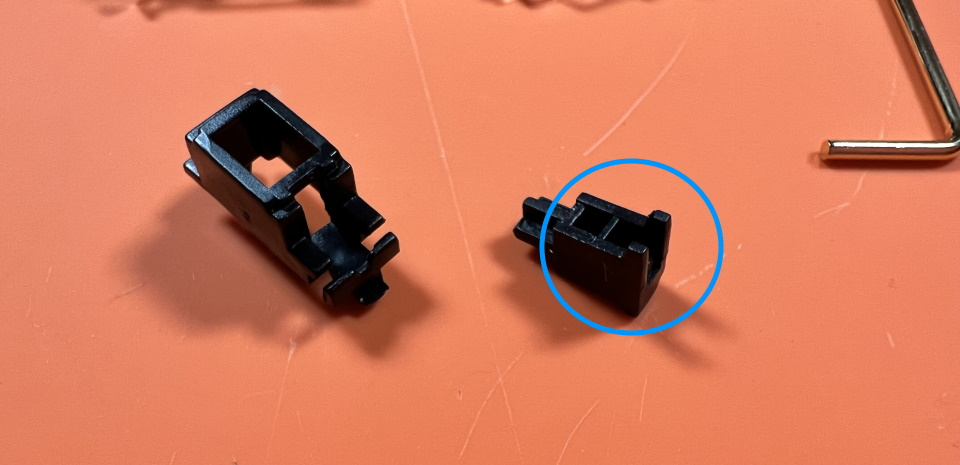
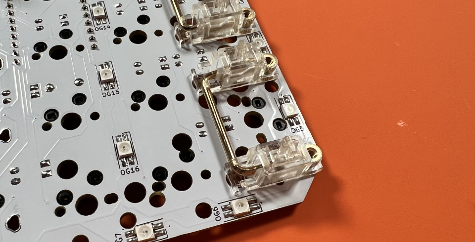
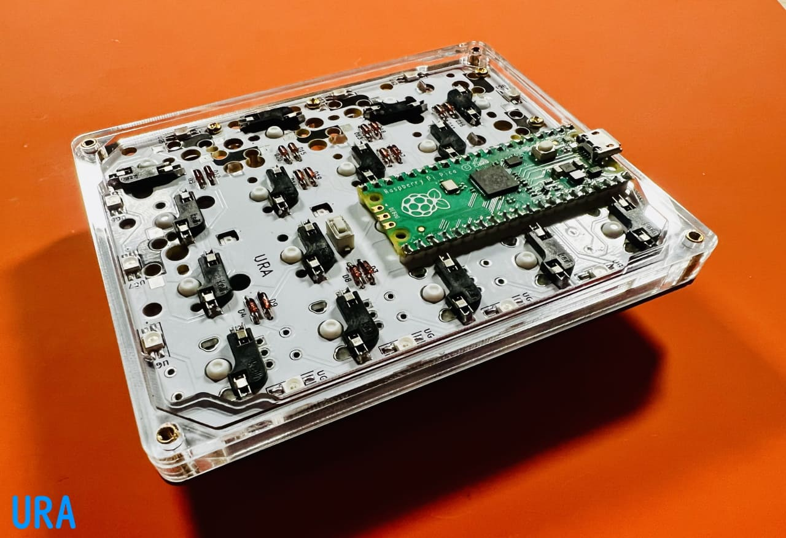
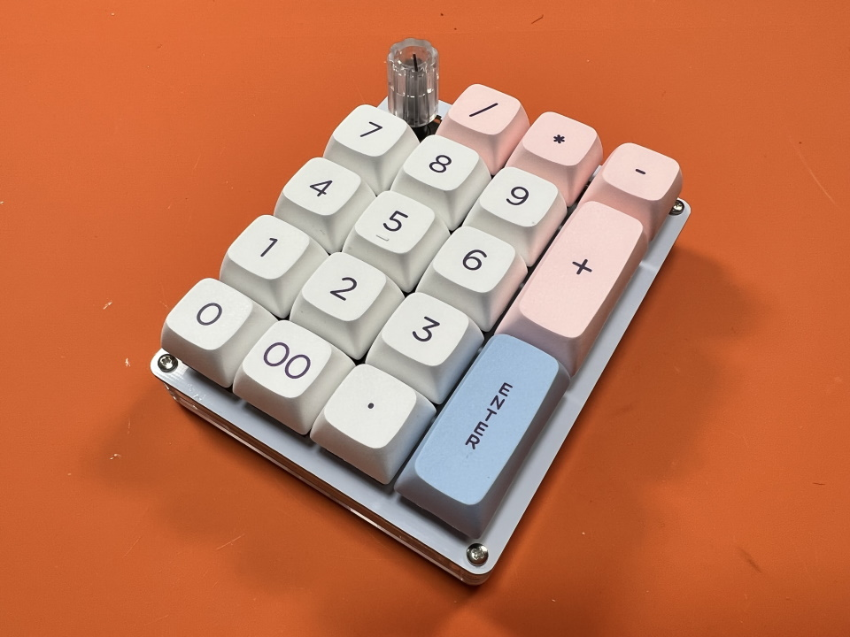
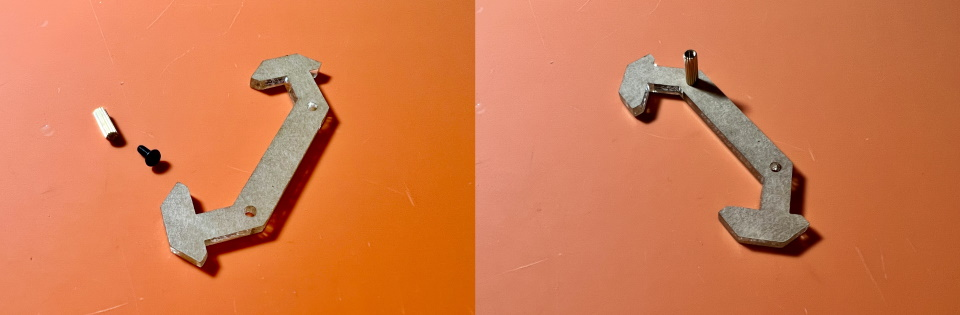

# Shotgun チェリーパイ Build Manual（[日本語](https://github.com/Taro-Hayashi/Shotgun-CherryPie/blob/main/README.md)）
- [Contens](#Contens)
- [Preparation](#Preparation)
- [Soldering](#Soldering)
- [Assembling](#Assembling)
- [Customise](#Customise)

## Contents
  
||Name|Quamtities| |
|-|-|-|-|
|1|Mainboard|1|
|2|Top plate|1||
|3|Bottom plate|1||
|4|Middle plate #1|1||
|5|Middle plate #2|1||
|6|Middle plate #3|1||
|7|Short screws|4|4mm|
|8|Long screws|4|8mm|
|9|Spacers|4|8mm|
|10|Diodes|20|1N4148|
|11|Tactile switch|1||
|12|Hotswap sockets|20||
|13|Rubber feet|4||
|-|Pin header|1||

### Additional required
|Name|Quantities|||
|-|-|-|-|
|Raspberry Pi Pico|1||[Yushakobo](https://shop.yushakobo.jp/en/products/raspberry-pi-pico)|
|Switches|11 - 20|Cherry MX|[Yushakobo](https://shop.yushakobo.jp/en/collections/all-switches/cherry-mx-%E4%BA%92%E6%8F%9B-%E3%82%B9%E3%82%A4%E3%83%83%E3%83%81)|
|Keycaps|11 - 20|Cherry MX|[Yushakobo](https://shop.yushakobo.jp/en/collections/keycaps/cherry-mx-%E4%BA%92%E6%8F%9B-%E3%82%AD%E3%83%BC%E3%82%AD%E3%83%A3%E3%83%83%E3%83%97)|
|Micro-USB Cable|1||[Yushakobo](https://shop.yushakobo.jp/en/products/usb-cable-micro-b-0-8m)|

### Optional
|Name|Quantities|||
|-|-|-|-|
|Conthrough|2|[Usage](https://github.com/Taro-Hayashi/Shotgun-CherryPie/blob/main/conthrough2_EN.md)|[Yushakobo](https://shop.yushakobo.jp/en/products/31?_pos=1&_sid=ca92edae3&_ss=r&variant=40815837610145)|
|Stabilizer||2U, PCB mounted|[Yushakobo](https://shop.yushakobo.jp/en/collections/all-keyboard-parts/Stabilizer)|
|Rotary encoders||EC11/EC12||
|knobs||Outer diameter up to 19mm||
|SK6812MINI-E|28||[Yushakobo](https://shop.yushakobo.jp/en/products/sk6812mini-e-10)|

## Preparation
### Determine key layout  
This kit has a variety of layouts to choose from.  
   
  

In this manual, we use rotary encoder and 2 2U keys.  
    
   

### Write firmware
Download PRK Firmware.
 - [Releases・picoruby/prk_firmware](https://github.com/picoruby/prk_firmware/releases)  

Click "Assets"
 

Connect the Raspberry Pi Pico to the PC while holding down the BOOTSEL button, it will be recognized as a USB memory device called RPI-RP2.    
   
   
Writing the uf2 file, it will automatically reboot and be recognized as a drive called PRK Firmware.  
   
Drag and drop this keymap.rb onto the drive.
 - [keymap.rb](https://github.com/Taro-Hayashi/Shotgun-CherryPie/releases/download/0.1/keymap.rb)  

Detouch the USB cable.

## Soldering

### LED
If use LED, install first.  
 - [LED Installation](led_EN.md)  

### Diodes and tactile switch

Install the diodes from D1 to D20.
   
Diodes have a direction.  
  
Bend the legs parallel to the diode to prevent interference with the key switch later.  
   
  
Solder and cut the legs.  
   
  
Solder Tactile Switches.   
   

### Hotswap sockets
Apply a thin layer of solder beforehand.  
    
Solder sockets.  
     

Be careful to keep the socket close to the board at the blue frame.  
   

### Rotary encoder  
     
   

### Raspberry Pi Pico
Stand the pin header on the back side of the board.  
   
Place and soloder the Raspberry Pi Pico. 
   
Cut and solder the surface legs.  
   

### Testing
Plug in the Raspberry Pi Pico and connect it to PC.  
   
   
## Assembling
### Stabilizers
  
    
   

Cut off the corners of the stabilizer because it would interfere with the acrylic.    
   
  

### Plates
Place the top plate on the main board.  
  
  
Install Switches.
  
  

Attach spacers with short screws.  
  

Place thicker middle plate #1 and thiner middle plate #2 on it.  
   

Put the middle plate #3.   
  

Fasten the back plate with long screws and put the rubber feet.  
  

Install the Keycaps.
  

Then connect to PC.

## Customise
These Keycodes are avilable.
- https://github.com/Taro-Hayashi/PRKFirmware0.9.7Keycode/blob/main/README_EN.md

Sample keymap from the build manual.
- https://github.com/Taro-Hayashi/Shotgun-CherryPie/releases/download/0.9.8/keymap.rb

### Change keys
Open keymap.rb in PRK Firmware drive.
~~~
kbd.add_layer :default, %i[
  KC_A  KC_B  KC_C  KC_D
  KC_E  KC_F  KC_G  KC_H
  KC_I  KC_J  KC_K  KC_L
  KC_M  KC_N  KC_O  KC_P
  KC_Q  KC_R  KC_S  KC_T
]
~~~

Change KC_* to change keys.  
Overwrite and save to update.  

### Rotary Encoder
~~~
encoder_1 = RotaryEncoder.new(27, 28)
encoder_1.clockwise do
  kbd.send_key :KC_1
end
encoder_1.counterclockwise do
  kbd.send_key :KC_2
end
kbd.append encoder_1
~~~

### Add layer
~~~
kbd.add_layer :lower, %i[
  KC_NO  KC_NO  KC_NO  KC_NO
  KC_NO  KC_NO  KC_NO  KC_NO
  KC_NO  KC_NO  KC_NO  KC_NO
  KC_NO  KC_NO  KC_NO  KC_NO
  KC_NO  KC_NO  KC_NO  KC_NO
]
~~~
Layer key is same as layer name.  

### Tap and hold key
~~~
kbd.define_mode_key :0_LOW, [ :KC_KP_0, :lower, 150, 150 ]
~~~

### Copmposite key
~~~
kbd.define_mode_key :UNDO,   [ %i(KC_Z KC_LCTL), :nil, 150, 150 ]
~~~

### String key
~~~
kbd.define_mode_key :TEST, [ Proc.new { kbd.macro "aaaa" }, :KC_NO, 300, nil ]
~~~
  
Completed. Thank you for your time.  
  

## Misc
### Switch pusher
  

### QMK Firmware
Install qmk uf2 file.
- [shotgun_cp_via.uf2](https://github.com/Taro-Hayashi/Shotgun-CherryPie/releases/download/0.9.8/shotgun_cp_via.uf2)

JSON for Remap/VIA
 - [shotgun_cp.json](https://github.com/Taro-Hayashi/Shotgun-CherryPie/releases/download/0.9.8/shotgun_cp.json)

### Plates data
 - [shotgun_cp_plates.zip](https://github.com/Taro-Hayashi/Shotgun-CherryPie/releases/download/0.9.8/shotgun_cp_plates.zip)  

### Thanks
Used foostan's footprint.  
https://github.com/foostan/kbd/  
https://github.com/foostan/kbd/blob/master/LICENSE  

Used Yoichiro's footprint.  
https://github.com/yoichiro/yoichiro-kbd  
https://github.com/yoichiro/yoichiro-kbd/blob/main/LICENSE 

Sekigon's qmk firmware branch  
https://github.com/sekigon-gonnoc/qmk_firmware/tree/rp2040

PRK Firmware  
https://github.com/picoruby/prk_firmware/

- BOOTH: https://tarohayashi.booth.pm/items/3430753
- Yushakobo: https://shop.yushakobo.jp/en/products/3415

