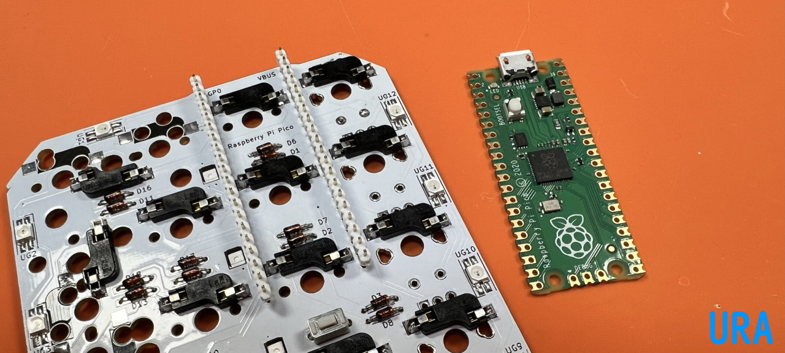

## 20ピンのコンスルーが手に入らない場合

### ピンヘッダを使う
キットに付属するピンヘッダをお使いいただけます。
40ピンのものを20ピンずつに切るか折るかしてください。  
   
はんだ付けが終わり、組み立ての手順に入る時に使います。  
Raspberry Pi Picoを取り外せなくなるので隠れてしまうダイオードやソケットの方向を改めて確認してください。  
  
ピンヘッダを基板に立てます。どちら側でも構いませんが長い方を挿したほうが足を切るのが楽かもしれません。  
   
Raspberry Pi Picoをはんだ付けします。  
   
表側の足を切りはんだ付けします。  
   
  
### 12ピンで代用する
または、12ピンや13ピンのコンスルーを4個で代用できます。    
はみ出す部分をお切りください。   
  
アクリルプレートに干渉するときはもう少し切ってください。  
  
[遊舎工房](https://shop.yushakobo.jp/products/31)、[TALPKEYBOARD](https://talpkeyboard.net/items/5e056626d790db16e2889233)、[Daily Craft Keyboard](https://shop.dailycraft.jp/products/conthrough)
