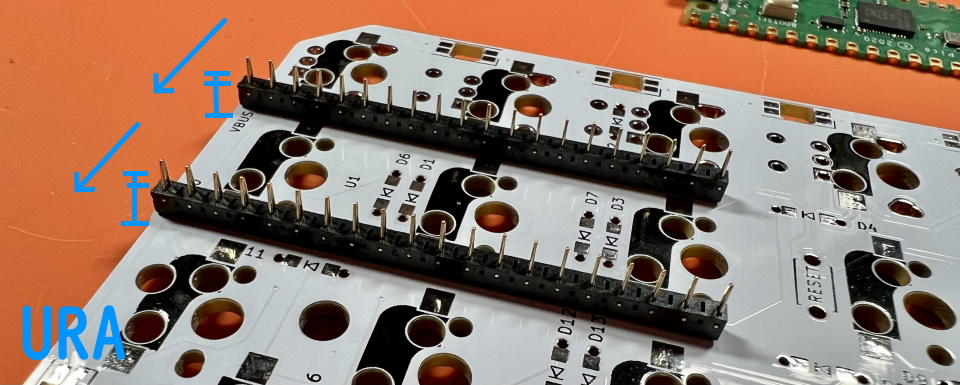
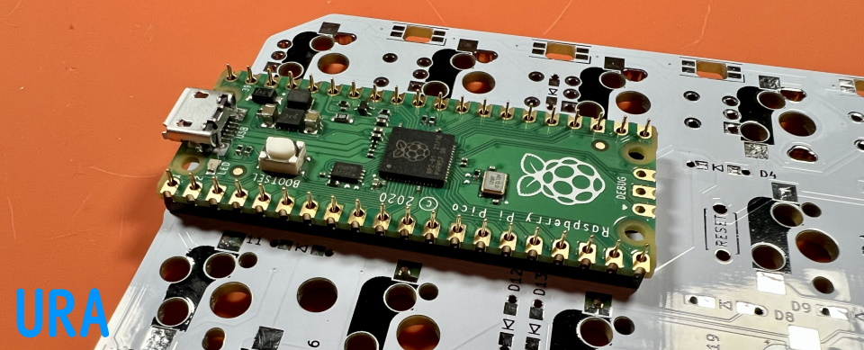

## コンスルーの使い方

コンスルーを使用するとRaspberry Pi Picoを抜き差しできるようになり。はんだ付けの途中で動作を確認したりRaspberry Pi Picoを他のキットに使いまわせるようになります。  
  
コンスルーを基板裏に立てます。窓が高く、同じ方向を向くようにします。  
   
基板側ははんだ付けしません。  
  
   
立てたコンスルーにRaspberry Pi Picoを乗せたらはんだ付けします。    
   
これで抜き差しできるようになりました。  
できるだけ垂直に力を加えてRaspberry Pi Picoを抜きます。  
  
### 12ピンで代用する
12ピンや13ピンのコンスルーを4個で代用できます。    
はみ出す部分をお切りください。   
  
アクリルプレートに干渉するときはもう少し切ってください。  
  
[遊舎工房](https://shop.yushakobo.jp/products/31)、[TALPKEYBOARD](https://talpkeyboard.net/items/5e056626d790db16e2889233)、[Daily Craft Keyboard](https://shop.dailycraft.jp/products/conthrough)  
  
ブラウザの機能で戻ってください。  
