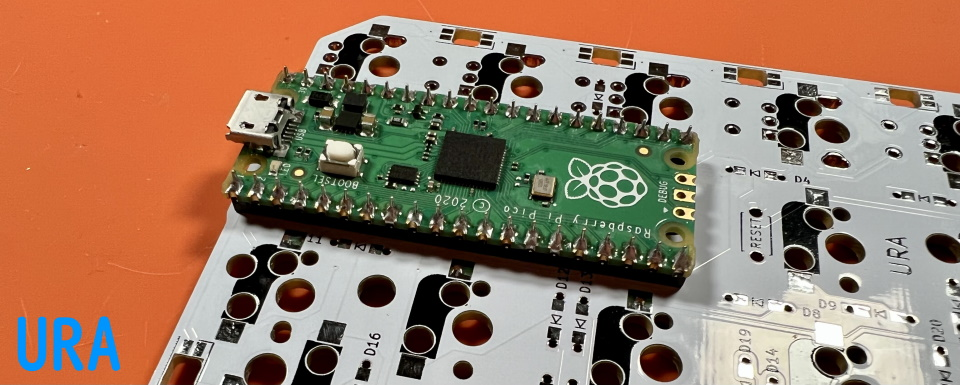

## Conthrough

Stand the consule on the back side of the board.No soldering on the board side.   
   
Make sure that the windows of the conthrough are high and facing the same direction.  
  
Place the Raspberry Pi Pico on it.  
   
Solder the Raspberry Pi Pico.  
   
pull out the Raspberry Pi Pico.
