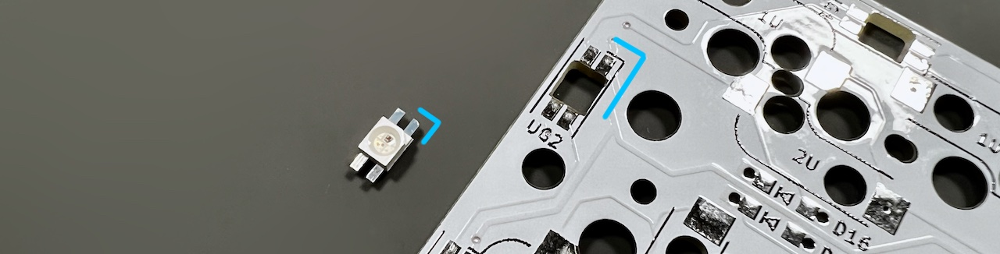
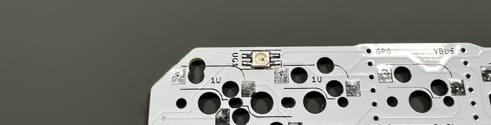
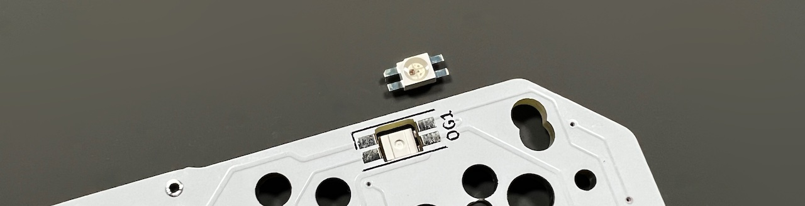
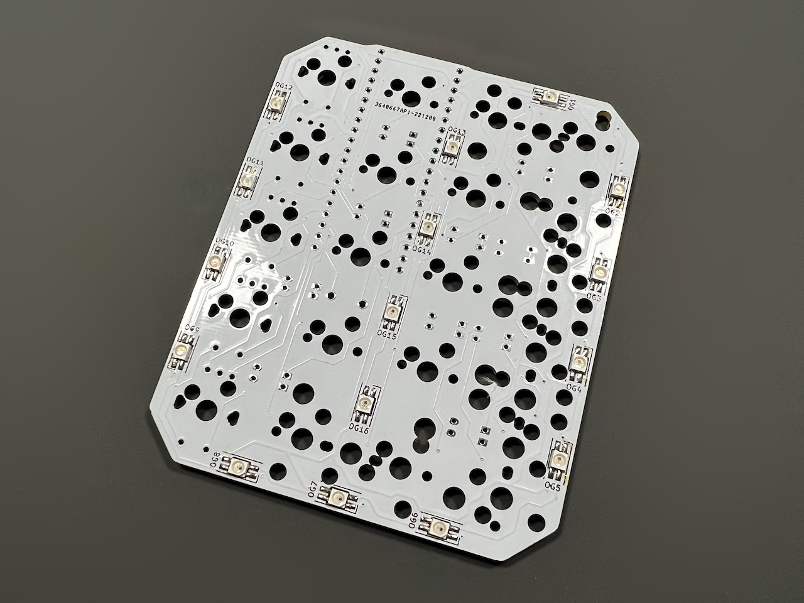

## LEDの取り付け方
  
裏面だけ光らせたい場合はUG1～12の12個、表面も光らせたい場合はOG1～16も合わせた28個をはんだ付けします。  
  
端子同士がくっつきやすいので、LEDのはんだ付けにはフラックスを使います。  
はんだ付けの難易度がとても下がるため私はLED以外にも毎回使っています。  
ベタつくのでフラックスクリーナーやIPA（イソプロピルアルコール）で掃除をすると綺麗になります。  
  
まずは裏面のUG1～12を取り付けます。  
LEDの切り欠きとシルク印刷のコーナーを合わせてはんだ付けしましょう。  
    
向きがバラバラなので毎回確認してください。方向を間違えるとショートしてしまってキーボード自体が動きません。  
    
    
    
両側のランドにはんだを乗せやすいようにLEDは中央に置くことを意識するといいと思います。  

裏面が終わったら表面のOG1～16を取り付けます。  
  
一部はUGと共通の穴を使っています。  

  

ブラウザの機能で戻ってください。  
