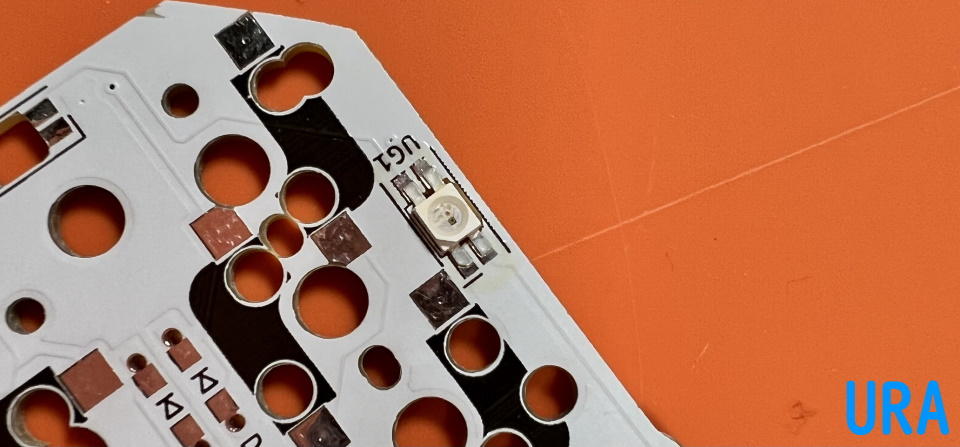
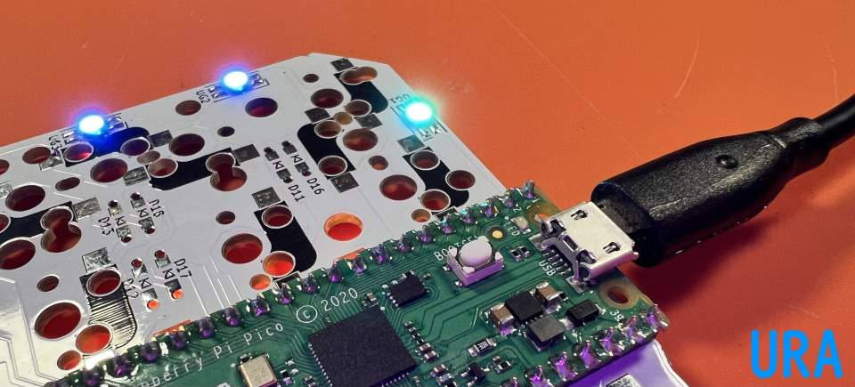

## LEDの取り付け方
  
裏面だけ光らせたい場合はUG1~12の12個、表面も光らせたい場合はOG1~16も合わせた28個をはんだ付けします。  
  
端子同士がくっつきやすいので、LEDのはんだ付けにはフラックスを使います。  
はんだ付けの難易度がとても下がるため私はLED以外にも毎回使っています。  
ベタつくのでフラックスクリーナーやIPA（イソプロピルアルコール）で掃除をすると綺麗になります。  
  
まずはUG1~12を取り付けます。  
LEDの切り欠きとシルク印刷のコーナーを合わせてはんだ付けしましょう。  
    
向きがバラバラなので毎回確認してください。間違えるとショートしてしまってキーボード自体が動きません。  
  
フラックスを塗り、こて先にのせたはんだを流し込むようにするとスムーズに付けられます。  
    
両側のランドにはんだを乗せやすいようにLEDは中央に置くことを意識するといいと思います。  

数個取り付けたらRaspberry Pi Picoを取り付けて光るかどうか確かめると安心です。
  
ブラウザの機能で戻ってください。
